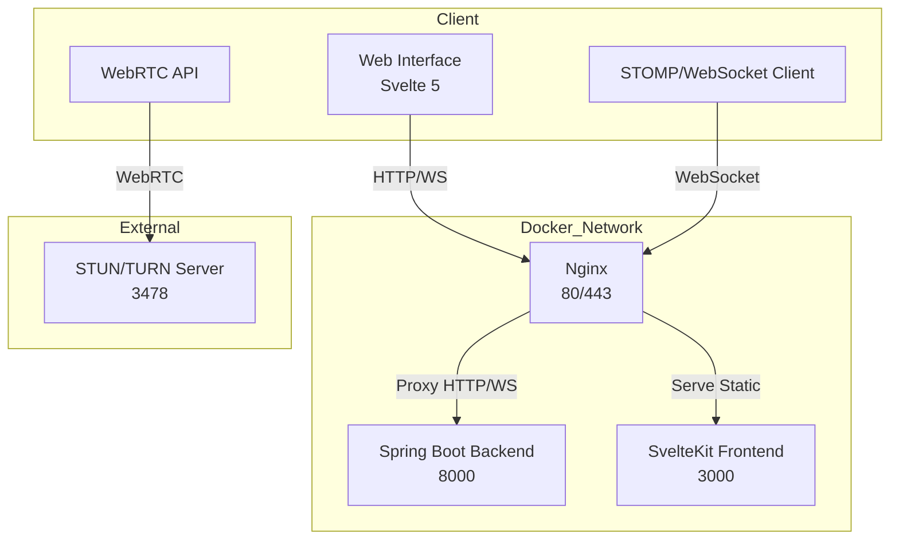

# WebRTC Video Call Application

A peer-to-peer video calling application built with **SvelteKit** (frontend), **Spring Boot** (backend), and **Nginx** (reverse proxy). Features real-time video/audio communication with a modern web interface, secure HTTPS, and Dockerized deployment.

> **Note:** Each room supports only 1:1 video calls. Multiple participants per room are not supported.

## 🏗️ Architecture



## 🚀 Features

- **Real-time Video Calls**: Peer-to-peer via WebRTC
- **Room-based Calls**: Private rooms for 1:1 conversations
- **Modern UI**: Built with SvelteKit
- **SSL Support**: Secure HTTPS via Nginx and custom certificates
- **Dockerized**: Easy deployment with Docker Compose
- **Responsive Design**: Works on desktop and mobile

## 📁 Project Structure

```text
WebRTC-Video-Call/
│
├── backend/                # Spring Boot backend (Java)
│   ├── src/
│   ├── pom.xml
│   └── Dockerfile
│
├── frontend/               # SvelteKit frontend (TypeScript)
│   ├── src/
│   ├── package.json
│   ├── Dockerfile
│   └── .env.example
│
├── nginx/                  # Nginx reverse proxy config
│   ├── nginx.conf
│   ├── Dockerfile
│   └── ssl/
│       ├── certificate.pem
│       └── private_key.pem
│
├── docker-compose.yml      # Multi-service orchestration
└── README.md
```

## 📋 Prerequisites

- Docker & Docker Compose
- Java 21+ (for backend local development)
- Node.js 24+ (for frontend local development)
- Maven 3.9+ (for backend local development)

## 🛠️ Quick Start (Docker Compose)

1. **Clone the repository**

   ```bash
   git clone https://github.com/AnishSarkar22/WebRTC-Video-Call.git
   cd WebRTC-Video-Call
   ```

2. **Configure Environment**

   - Edit `frontend/.env` (copy from `.env.example`) and set your WebSocket URL if needed:
     ```
     VITE_WEBSOCKET_URL=wss://your-domain.com/ws
     ```
   - Edit `nginx/nginx.conf` and set your domain or use `server_name _;` for all hosts.

3. **Create SSL Certificates (for HTTPS)**

   ```bash
   mkdir -p nginx/ssl
   openssl req -x509 -newkey rsa:4096 -keyout nginx/ssl/private_key.pem -out nginx/ssl/certificate.pem -days 365 -nodes
   ```

4. **Build and Start All Services**

   ```bash
   docker-compose up --build
   ```

5. **Access the Application**

   - HTTP: `http://localhost`
   - HTTPS: `https://localhost`

## 🔧 Configuration

### Backend (`backend/src/main/resources/application.properties`)

```properties
socket.host=0.0.0.0
socket.port=8000
server.port=8000
server.address=0.0.0.0
```

### Frontend (`frontend/.env`)

```env
VITE_WEBSOCKET_URL=wss://your-domain.com/ws
```

### Nginx (`nginx/nginx.conf`)

- Proxies `/ws` and API requests to backend (`backend:8000`)
- Serves frontend static files or proxies to frontend container (`frontend:3000`, `4173`, or `5173`)

## 🐳 Docker Compose Overview

- **backend**: Spring Boot app on port 8000
- **frontend**: SvelteKit app (dev: 5173, preview: 4173, prod: 3000)
- **nginx**: Reverse proxy on 80/443, SSL termination, static file serving

## 🔌 Key Components

### Backend

- **Spring Boot**: REST API & WebSocket (STOMP) signaling server
- **RoomService**: Manages room membership and signaling
- **WebSocketConfig**: Configures STOMP endpoints

### Frontend

- **SvelteKit**: Modern reactive UI
- **websocket.svelte.ts**: Handles STOMP/WebSocket signaling
- **webrtc.svelte.ts**: Manages WebRTC peer connections

## 🧪 Testing

### Backend

```bash
cd backend
./mvnw test
```

### Frontend

```bash
cd frontend
npm install
npm run test
```

## 🤝 Usage

1. Open the app in your browser.
2. Create or join a room.
3. Share the room ID with another user.
4. Both users connect via WebRTC for a 1:1 video call.

## 🔒 SSL Configuration

- Self-signed certificates for local development are in `nginx/ssl/`.
- For production, replace with certificates from a trusted CA.

## 📦 Dependencies

- **Spring Boot 3.2.6**
- **Svelte 5 and Sveltekit**
- **STOMP/WebSocket**
- **Nginx**

## 📄 License

This project is licensed under the [MIT License](LICENSE).