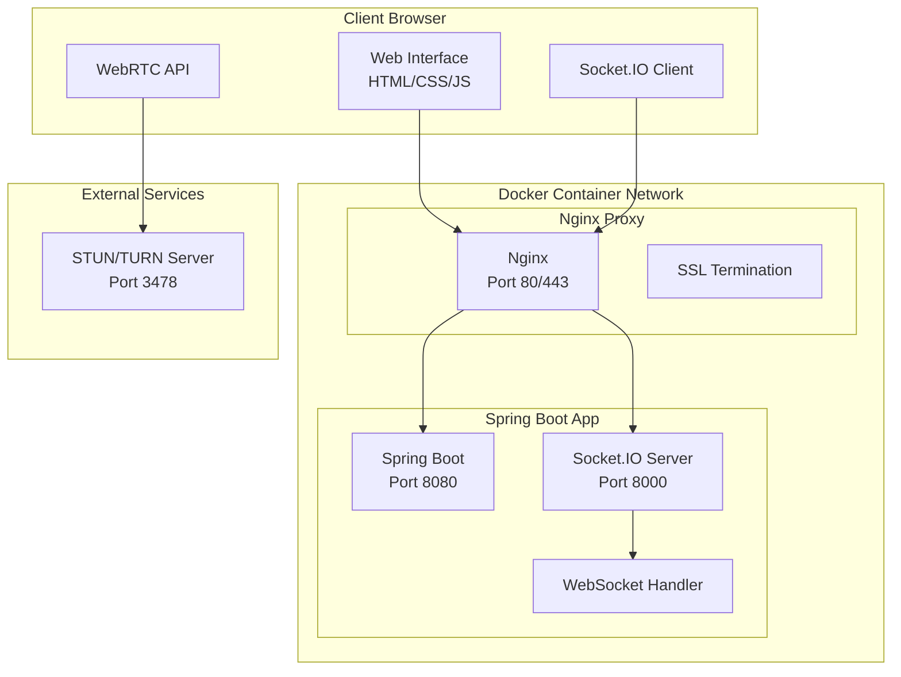

# WebRTC Spring Boot Video Call Application

A peer-to-peer video calling application built with Spring Boot, WebRTC, Socket.IO, and Docker. Features real-time video/audio communication with a clean web interface.

> **Note:** This application allows multiple rooms, but each room is strictly for a 1:1 video call. Multiple participants per room are not supported.

## 🏗️ Architecture



## 🚀 Features

- **Real-time Video Calls**: Peer-to-peer communication using WebRTC
- **Audio/Video Controls**: Toggle camera and microphone
- **Room-based Calls**: Join specific rooms for private conversations
- **SSL Support**: Secure HTTPS connections with custom certificates
- **Docker Deployment**: Containerized application with Nginx reverse proxy
- **Responsive UI**: Bootstrap-based interface

## 📋 Prerequisites

- Docker & Docker Compose
- Java 17+ (for local development)
- Maven 3.9+ (for local development)

## 🛠️ Quick Start

### Using Docker (Recommended)

1. **Clone the repository**

   ```bash
   git clone <repository-url>
   cd spring-boot-webrtc-peer2peer
   ```

2. **Update IP configuration**
   - Edit [`src/main/resources/static/client.js`](src/main/resources/static/client.js) line 1:

     ```javascript
     const LOCAL_IP_ADDRESS = "YOUR_IP"; // Replace with your IP
     ```

   - Edit [`nginx/nginx.conf`](nginx/nginx.conf) line 3 and 10:

     ```nginx
     set $ip_address <YOUR_IP>; # Replace with your IP
     ```

3. **Start the application**

   ```bash
   docker-compose up --build
   ```

4. **Access the application**
   - HTTP: `http://YOUR_IP`
   - HTTPS: `https://YOUR_IP`

### Local Development

1. **Build and run**

   ```bash
   ./mvnw clean package
   ./mvnw spring-boot:run
   ```

2. **Access at** `http://localhost:8080`

## 🔧 Configuration

### Application Properties

[`src/main/resources/application.properties`](src/main/resources/application.properties)

```properties
socket.host=0.0.0.0
socket.port=8000
server.address=0.0.0.0
```

### Docker Configuration

- **Spring Boot**: Runs on ports 8080 (HTTP) and 8000 (Socket.IO)
- **Nginx**: Reverse proxy on ports 80/443 with SSL termination
- **SSL Certificates**: Located in [`ssl/`](ssl/) directory

## 📁 Project Structure

```text
├── src/main/java/com/anishsarkar/webrtcvideocall/
│   ├── WebRTCApplication.java          # Main application class
│   ├── SocketHandler.java              # WebSocket event handler
│   ├── WebSocketConfig.java            # Socket.IO configuration
│   └── WebConfiguration.java           # Web MVC configuration
├── src/main/resources/static/
│   ├── index.html                      # Main UI
│   ├── client.js                       # WebRTC client logic
│   └── style.css                       # UI styles
├── nginx/                              # Nginx configuration
├── ssl/                                # SSL certificates
└── docker-compose.yml                 # Docker orchestration
```

## 🔌 Key Components

### Backend

- **[`SocketHandler`](src/main/java/com/anishsarkar/webrtcvideocall/SocketHandler.java)**: Manages WebSocket connections and room operations
- **[`WebSocketConfig`](src/main/java/com/anishsarkar/webrtcvideocall/WebSocketConfig.java)**: Configures Socket.IO server
- **[`WebConfiguration`](src/main/java/com/anishsarkar/webrtcvideocall/WebConfiguration.java)**: Sets up CORS and view controllers

### Frontend

- **[`client.js`](src/main/resources/static/client.js)**: WebRTC peer connection management
- **[`index.html`](src/main/resources/static/index.html)**: Bootstrap-based responsive UI

## 🔒 SSL Configuration

The application includes self-signed certificates in the [`ssl/`](ssl/) directory. For production, replace with proper SSL certificates:

```bash
# Generate new certificates
openssl req -x509 -newkey rsa:4096 -keyout ssl/private_key.pem -out ssl/certificate.pem -days 365 -nodes
```

## 🧪 Testing

Run tests with Maven:

```bash
./mvnw test
```

Test results are available in [`target/surefire-reports/`](target/surefire-reports/).

## 📦 Dependencies

- **Spring Boot 3.2.6**: Web framework
- **Netty Socket.IO 1.7.23**: Real-time communication
- **Lombok 1.18.32**: Code generation
- **Bootstrap 5.3**: UI framework

## 🤝 Usage

1. Open the application in your browser
2. Enter a room name and click "Connect"
3. Share the room name with another user
4. Both users will automatically connect via WebRTC
5. Use the camera/microphone buttons to control media

## 📄 License

This project is licensed under the [MIT License](LICENSE).
